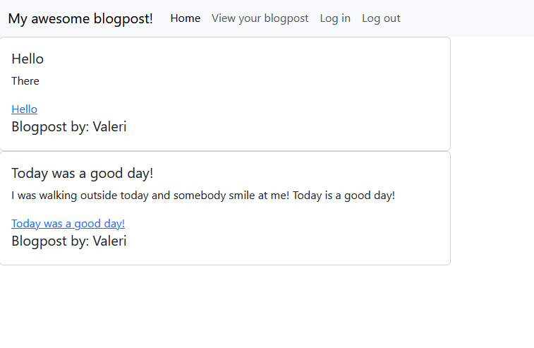

# myblogdashboard

## Description
This is an app to post blogpost, and add comments on it!

## Usage
To use this app, go to https://obscure-cove-95749.herokuapp.com/.
You will need to log in/create an account then you can post blog post.
If you are on the main page, you can click on the blogpost title to add comment to it.
You can also log out once you are done.

## Deployed link
https://obscure-cove-95749.herokuapp.com/

## Screenshot

## Credit
[Valerigionetnoel](https://github.com/Valerigionetnoel) you can email me [here](mailto:valeri.gionetnoel@gmail.com)

## License

Refer to license in repo for more information.